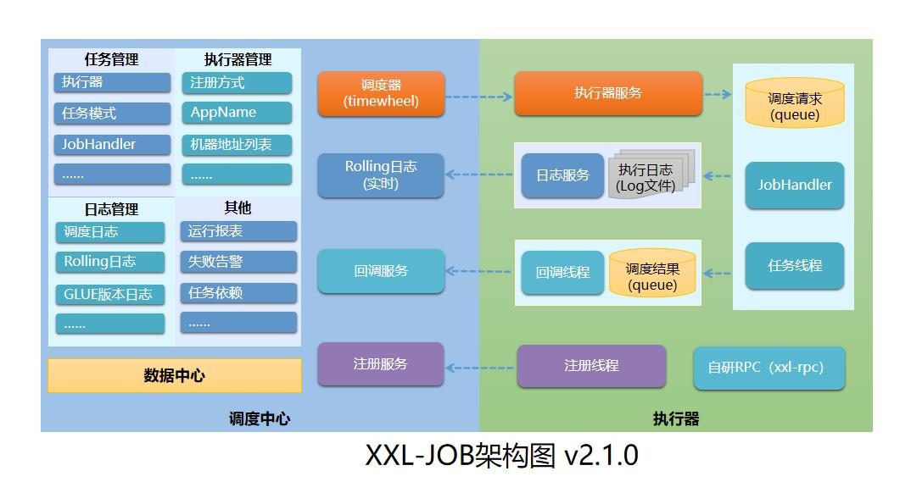
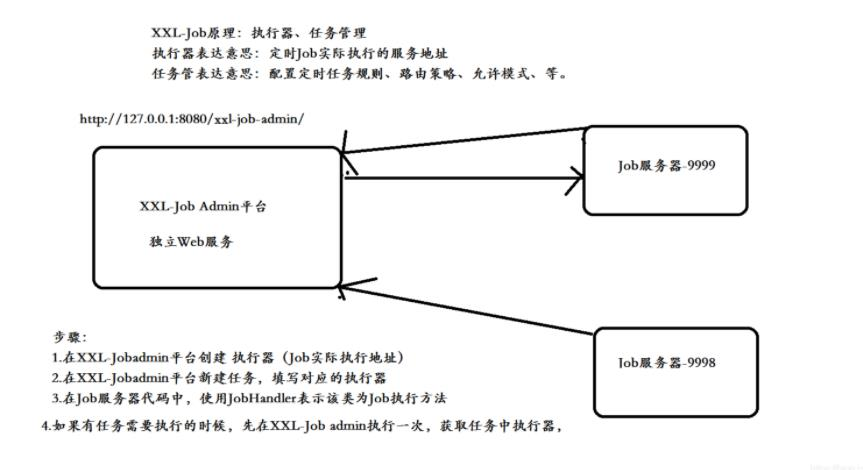
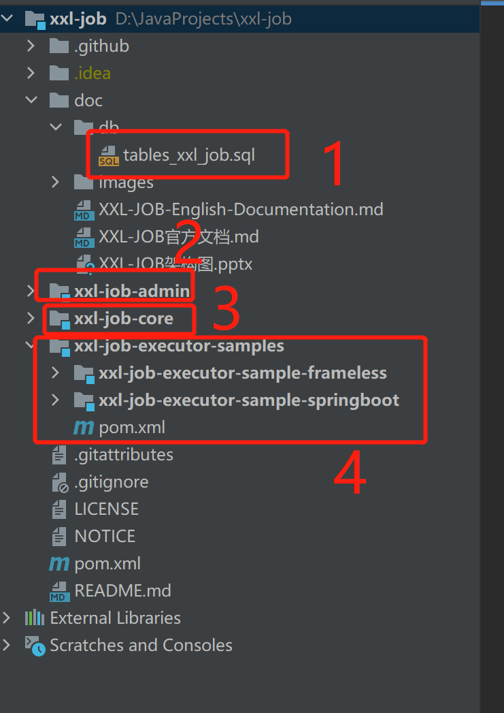

# 1.定时任务介绍
## 1.1 基础
- **定时任务**：是指在指定的时间点执行某项任务，比如每天凌晨 1 点执行一次任务，每隔 5 分钟执行一次任务等。
- **Cron表达式**：是一个字符串，字符串以 5/6 个空格隔开，分为 6/7 个域，每个域代表一个含义，Cron表达式的格式如下：
>
> <秒> <分> <时> <日> <月> <周> <年>
> ref: https://help.aliyun.com/document_detail/133509.html

- 常见的定时任务框架：
  - JDK内置的`Timer`
  - Spring中的`@Scheduled`，集成`Quartz`
  - 分布式集群：`Quartz`、`Elastic-Job`、`xxl-job`

# 2.xxl-job介绍
## 2.1 特性
> 1、简单：支持通过Web页面对任务进行CRUD操作，操作简单，一分钟上手；
> 2、动态：支持_动态修改任务状态、启动/停止任务，以及终止运行中任务，即时生效_；
> 3、调度中心HA（中心式）：调度采用中心式设计，调度中心自研调度组件并支持集群部署，可保证调度中心HA；
> 4、执行器HA（分布式)：任务分布式执行，任务"执行器"支持集群部署，可保证任务执行HA；
> 5、注册中心: 执行器会周期性自动注册任务, 调度中心将会自动发现注册的任务并触发执行。也支持手动录入执行器地址；
> 6、弹性扩容缩容：一旦有新执行器机器上线或者下线，下次调度时将会重新分配任务；
> 7、路由策略：执行器集群部署时提供丰富的路由策略，包括：_第一个、最后一个、轮询、随机、一致性HASH、最不经常使用、最近最久未使用、故障转移、忙碌转移_等；
> 8、故障转移：任务路由策略选择_故障转移_情况下，如果执行器集群中某一台机器故障，将会自动Failover切换到一台正常的执行器发送调度请求。
> 9、阻塞处理策略：调度过于密集执行器来不及处理时的处理策略，策略包括：单机串行（默认）、丢弃后续调度、覆盖之前调度；
> 10、任务超时控制：支持_自定义任务超时时间_，任务运行超时将会主动中断任务；
> 11、任务失败重试：支持_自定义任务失败重试次数_，当任务失败时将会按照预设的失败重试次数主动进行重试；其中分片任务支持分片粒度的失败重试；
> 12、任务失败警告：默认提供邮件方式失败告警，同时预留扩展接口，可方便的扩展短信、钉钉等告警方式；
> 13、分片广播任务：执行器集群部署时，任务路由策略选择分片广播情况下，一次任务调度将会广播触发集群中所有执行器执行一次任务，可根据分片参数开发分片任务；
> 14、动态分片：分片广播任务以执行器为维度进行分片，支持动态扩容执行器集群从而动态增加分片数量，协同进行业务处理；在进行大数据量业务操作时可显著提升任务处理能力和速度。
> 15、事件触发：除了Cron方式和任务依赖方式触发任务执行之外，支持基于事件的触发任务方式。调度中心提供触发任务单次执行的API服务，可根据业务事件灵活触发.
> ......

## 2.2 架构

### 2.2.1 设计思想
- 将调度行为抽象形成“调度中心”公共平台，而平台自身并不承担业务逻辑，“调度中心”负责发起调度请求。
- 将任务抽象成分散的JobHandler，交由“执行器”统一管理，“执行器”负责接收调度请求并执行对应的JobHandler中业务逻辑。
- 因此，“调度”和“任务”两部分可以相互解耦，提高系统整体稳定性和扩展性；
### 2.2.2 系统组成
- 调度中心
  1. 负责管理调度信息，按照调度配置发出调度请求，自身不承担业务代码。调度系统与任务解耦，提高了系统可用性和稳定性，同时调度系统性能不再受限于任务模块；
  2. 支持可视化、简单且动态的管理调度信息，包括任务新建，更新，删除，GLUE开发和任务报警等，所有上述操作都会实时生效，同时支持监控调度结果以及执行日志，支持执行器Failover。
  3. 支持在线修改调度状态，支持在线触发任务，支持手动录入执行器地址，支持手动终止运行中任务，支持手动触发一次任务调度，支持手动清理调度日志。
- 执行器
  1. 负责接收调度中心的调度请求并执行对应的JobHandler中业务逻辑，执行器可同时执行多个任务，支持并发执行和分片广播任务；
  2. 支持任务失败重试、失败告警、失败路由策略、分片任务、分片广播任务、动态分片等特性；
  3. 接收“调度中心”的执行请求、终止请求和日志请求等。
### 2.2.3 调度流程
  
  1. XXL-Job-admin平台创建执行器（Job实际执行地址）
  2. XXL-Job-admin平台新建任务，填写对应的执行器
  3. Job服务器代码中，使用JobHandler表示该类为Job执行方法
  4. 当任务执行的时候，会现在XXL-Job admin调度平台先执行一次，获取任务中的执行器，然后去对应的执行器地址服务器，执行对应的任务

# 3.xxl-job使用
## 3.1 下载源码
- 下载之后如下图所示，其中1表示数据库初始化脚本（存储任务配置和日志信息），2表示调度中心（负责任务的调度和管理），3表示公共依赖，4表示执行器（任务的具体执行）

### 3.1.1 初始化数据库
### 3.1.2 配置调度中心
### 3.1.3 配置执行器

# 4.xxl-job源码分析
TODO
# 5.参考资料
- https://www.xuxueli.com/xxl-job/#%E6%BA%90%E7%A0%81%E4%BB%93%E5%BA%93%E5%9C%B0%E5%9D%80
- https://www.cnblogs.com/fantongxue/p/16615093.html
